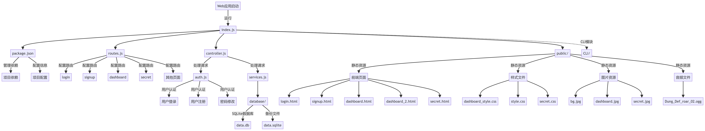
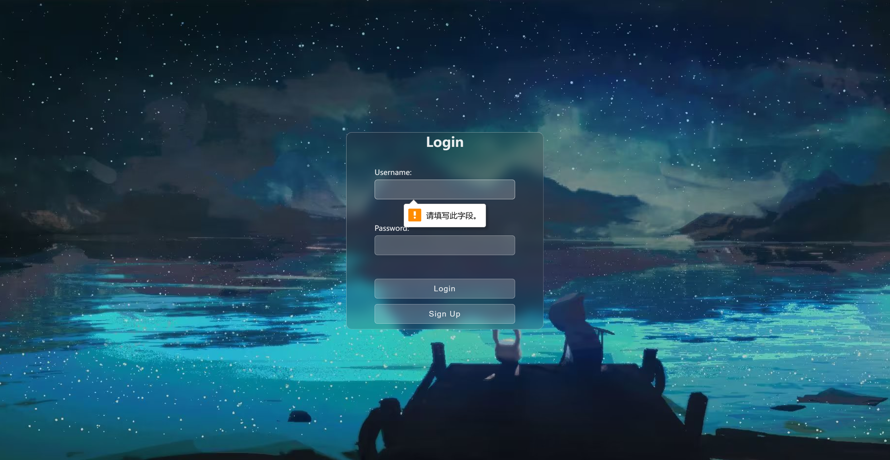
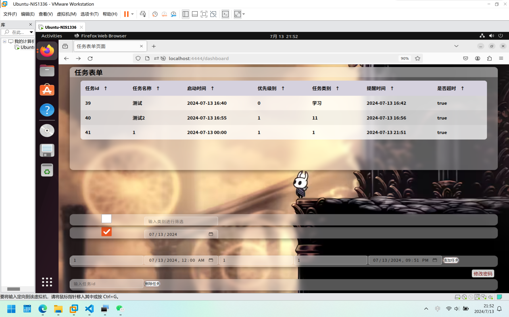

# ScheduleManager项目设计文档

## 1. 小组成员与分工

| 姓名   | 邮箱                      | 分工                 |
| ------ | ------------------------- | -------------------- |
| 王桢锐 | blizzard-wang@sjtu.edu.cn | 负责命令行版本的实现 |
| 何昊聪 | haocong-he@sjtu.edu.cn    | 负责Web版本的实现    |


## 2.  命令行版本设计

### （1）模块与类的设计

命令行版本的总体设计如下：

```bash
schedule/
├── CLI/
│   ├── build/                      # 编译生成的目录，包含生成的可执行文件
│   ├── include/                    # 头文件目录
│   │   ├── Interact.h              # 与用户交互相关的函数声明
│   │   ├── Reminder.h              # 提醒功能相关的类声明
│   │   ├── Task.h                  # 任务类的声明
│   │   ├── TaskManager.h           # 任务管理类的声明
│   │   ├── TimeUtils.h             # 时间处理工具函数的声明
│   │   ├── User.h                  # 用户类的声明
│   │   ├── Utils.h                 # 工具函数的声明
│   ├── src/                        # 源文件目录
│   │   ├── main.cpp                # 项目的主程序入口
│   │   ├── Interact.cpp            # 与用户交互相关的函数实现
│   │   ├── Reminder.cpp            # 提醒功能相关的类实现
│   │   ├── Task.cpp                # 任务类的实现
│   │   ├── TaskManager.cpp         # 任务管理类的实现
│   │   ├── TimeUtils.cpp           # 时间处理工具函数的实现
│   │   ├── User.cpp                # 用户类的实现
│   │   ├── Utils.cpp               # 工具函数的实现
│   ├── test.sh                     # 自动化测试脚本，用于测试命令行版本的功能
│   ├── CMakeLists.txt              # CMake 配置文件，用于生成项目的构建系统
├── web/                            # Web 版本的代码和相关文件
|...
```


## 3. Web版本设计

### 项目结构

```bash
schedule/
├── CLI/
├── web/
│   ├── database/                  # 数据库
│   │   ├── data.db                # sqlite数据库文件
│   │   ├── data.sqlite            # 备份文件
│   ├── public/                    # 静态资源目录，包含前端页面和样式文件
│   │   ├── image/                 # 图片资源
│   │   │   ├── bg.jpg             # 登录页面背景
│   │   │   ├── dashboard.jpg      # 操作页面背景
│   │   │   ├── secret.jpg         # 修改密码页面背景
│   │   ├── Dung_Def_roar_02.ogg   # 提醒音频文件
│   │   ├── login.html             # 用户登录页面
│   │   ├── signup.html            # 用户注册页面
│   │   ├── dashboard.html         # 用户操作界面
│   │   ├── dashboard_2.html
│   │   ├── secret.html            # 修改密码界面
│   │   ├── dashboard_style.css    # 样式表文件
│   │   ├── style.css       
│   │   ├── secret.css
│   ├── auth.js                    # 用户认证模块           
│   ├── controller.js              # 前后端交互控制模块
│   ├── services.js                # 数据库交互模块
│   ├── routes.js                  # 路由配置模块
│   ├── index.js                   # 服务器启动文件
│   ├── package.json               # 项目依赖和配置
```




### （1）技术栈
- **前端**：HTML, CSS, JavaScript
- **后端**：Node.js, Express.js
- **数据库**：SQLite
- **安全**：CryptoJS（密码加密）

### （2）模块划分
- **用户认证模块**：处理用户登录、注册、密码修改等认证相关操作。
- **任务管理模块**：提供任务的添加、查询、删除等功能。
- **提醒功能模块**：设置任务提醒，并在指定时间发送提醒。

### （3）关键功能实现
- **用户登录**：通过`/login`路由，使用户能够登录系统。
- **用户注册**：通过`/signup`路由，允许新用户注册账户。
- **密码修改**：通过`/change-password`路由，允许用户修改密码。
- **任务添加**：通过`/add-task`路由，用户可以添加新任务。
- **任务查询**：支持按日期和类别查询任务。
- **任务删除**：通过`/delete-task`路由，用户可以删除指定的任务。

### （4）数据库设计
- **Tasks 表**：存储任务信息，包括任务ID、名称、开始时间、优先级、类别、提醒时间、用户ID和完成状态。
- **Users 表**：存储用户信息，包括用户ID、用户名和加密后的密码。

### （5）安全性考虑
- 使用HTTPS协议保证数据传输安全。
- 密码在存储前使用CryptoJS库进行SHA-256加密。

### （6）部署与运行
- 使用`express`库创建和管理服务器。
- 通过命令行输入`node index.js`运行本地服务。
- 浏览器打开`http://localhost:4444/`访问Web应用。

### 关键技术说明

#### Web服务器构建
使用 `express` 框架来创建和管理服务器及其路由。

#### 用户认证
通过 `session` 中间件管理用户会话，使用 `req.session` 来存储用户登录状态。`checkUser` 函数用于中间件，检查用户是否已登录。

#### 数据库交互
使用 `sqlite3` 和 `sqlite` 库来操作 SQLite 数据库，创建 `Tasks` 和 `Users` 表，并进行数据的增删改查操作。

#### 密码加密
使用 `CryptoJS` 库对用户密码进行 SHA-256 加密，确保存储在数据库中的密码安全性。

#### 路由管理
通过定义不同的路由来处理不同的 HTTP 请求，如登录 (`/login`)、注册 (`/signup`)、任务添加 (`/add-task`)、任务查询 (`/query-tasks`) 等。

#### 静态文件托管
使用 `express.static` 中间件来托管静态文件，如 HTML 页面和 CSS 样式表。

#### 异步操作
大量使用 `async/await` 语法来处理异步数据库操作，提高代码的可读性和维护性。

#### 错误处理
使用 `try/catch` 语句来捕获和处理可能发生的错误，确保程序的健壮性。

#### 安全性
在用户注册和密码修改时，对密码进行加密处理，避免明文密码存储。

#### RESTful API设计
遵循 RESTful 原则设计 API，使用不同的 HTTP 方法（如 GET, POST, DELETE）来实现资源的获取、创建和删除。

#### 前端页面跳转
根据用户的操作结果，使用 `res.redirect` 进行页面跳转，如登录成功后跳转到 `/dashboard`。

#### 服务端渲染
通过 `res.sendFile` 将 HTML 页面作为响应发送给客户端浏览器。

#### 模块化
将不同的功能划分为不同的模块（如 `auth`, `services`, `controller` 等），并使用 `module.exports` 进行导出，提高代码的可维护性和可重用性。

### 项目展示





